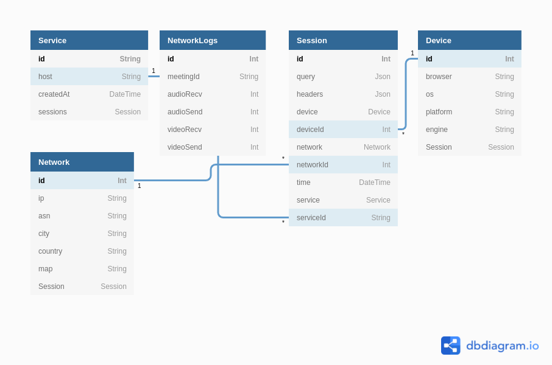

# Microsoft Engage Server

## Run the API locally

```bash
cd server/
yarn # install dependencies
yarn update # generate prisma typings
yarn dev # start the dev server
```

-   `yarn studio` Load Prisma Studio
-   `yarn db-save ${name}` Commit db changes
-   `docker build` to build the docker image and then add the _ENV_ variables

---

## Database Schema



## API Reference

#### Video Call Connection Health

```http
POST /health
```

| Parameter   | Type     | Description                                       |
| :---------- | :------- | :------------------------------------------------ |
| `id`        | `string` | **Required**. Requested service name (`id=teams`) |
| `meetingId` | `string` | **Required**. Meeting ID                          |
| `audioRecv` | `number` | **Required**. Receiving audio quality             |
| `audioSend` | `number` | **Required**. Sending audio quality               |
| `videoRecv` | `number` | **Required**. Receiving video quality             |
| `videoSend` | `number` | **Required**. Sending video quality               |

#### Invite a member

```http
POST /invite
```

| Parameter | Type     | Description              |
| :-------- | :------- | :----------------------- |
| `id`      | `string` | **Required**. Meeting ID |
| `email`   | `string` | **Required**. Email      |

#### 1x1 Pixel to log network requests

```http
GET /:id/hello.png
```

`id = teams` for this project

#### Network logs

```http
GET /service/:id/logs?paginate=100
```

`id = teams` for this project

| Parameter  | Type     | Description                                       |
| :--------- | :------- | :------------------------------------------------ |
| `id`       | `string` | **Required**. Requested service name (`id=teams`) |
| `paginate` | `number` | **Optional**. Number of records                   |

---

## Environment Variables

To run this project, you will need to add the following environment variables to your .env file

`DATABASE_URL` - PostgreSQL Database URI  
`MAILGUN_API_KEY` - Send emails using [Mailgun]("https://mailgun.com/)
